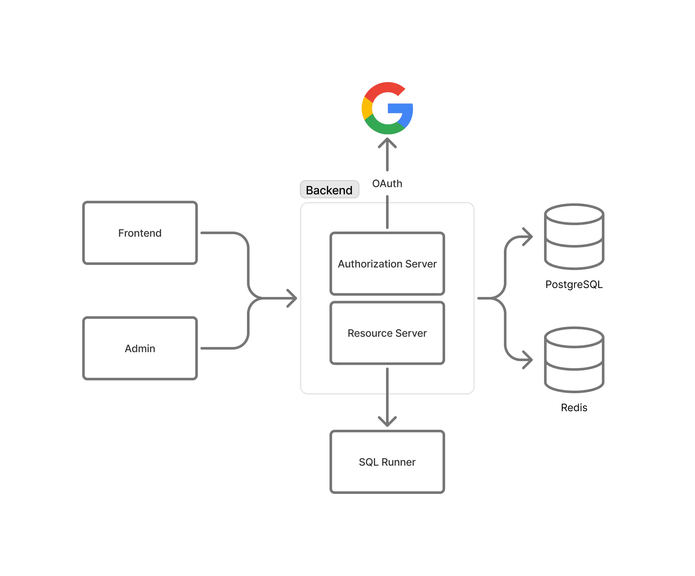

# 資料庫練功坊 (Database Playground)

「資料庫練功坊」是一套專為國立高雄科技大學智慧商務系資料庫課程設計的 **雲端適性化 SQL 學習系統**。本專案目的在解決 SQL 初學者常遇到的學習瓶頸，透過深度整合遊戲化機制與多模型 AI Agent，打造一個能激發學習動機、培養獨立思考，並適應個人學習風格的創新教育環境。

本系統核心理念為「**真正的學習並非來自於答案的給予，而是源於探索過程的引導**」。為此，本系統不僅是一個線上解題平台，更是一個兼具「動機驅動」與「認知啟發」的智慧學習生態系。

## 系統主要特色

- **AI 智慧教練**
  - **啟發式引導**：AI 教練扮演「思維引導者」而非「答案提供者」。當學生遇到瓶頸時，AI 會透過蘇格拉底式的提問，引導學生反思邏輯盲點，培養獨立解決問題的能力。
  - **多模型混合架構**：為兼顧品質與成本，系統採用多模型 AI Agent 架構。前端使用輕量的 Google Gemini 2.5 Flash 進行預處理和上下文壓縮，再交由推理能力更強的 Anthropic Claude 4.5 Sonnet 產生核心教學策略，大幅降低 API 成本與延遲。
  - **融合教育理論**：AI 結合 **布魯姆分類法 (Bloom's Taxonomy)**，根據題目認知層級調整提問深度。未來更規劃導入 **Kolb 學習風格分析**，實現真正的個人化因材施教。
- **完善的遊戲化機制**
  - **多元激勵設計**：系統融入「每日登入獎勵」、「連續解題 (Streak) 積分加成」、「排行榜」與「成就徽章」等機制，將枯燥的語法練習轉化為有趣的闖關挑戰，有效維持學習熱情。
  - **動機與認知雙引擎**：遊戲化機制滿足學生的外在動機，驅使其養成練習習慣；AI 教練則在學生解題成功後提升其自我效能感，形成正向的內在驅動力。
- **現代化的開發與系統架構**
  - **雲端原生微服務**：系統完全建構於現代化的微服務架構之上，後端核心採用 Go 語言，前端則使用 Next.js。各服務獨立解耦，確保系統在高流量下的穩定性與擴展性。
  - **AI 協作開發流程**：我們將 AI 工具全面融入軟體開發生命週期 (SDLC)。使用 Cursor IDE 將 Figma 設計稿自動轉換為 React 程式碼；採規格驅動開發 (Spec-Driven Development) 模式，由 AI 輔助生成符合規格的後端程式碼與測試案例。
  - **持續交付 (CD)**：前端與後端分別部署於 Vercel 和 Zeabur 平台，並與 GitHub 整合，做到持續部署，確保快速迭代與交付。

## 敏捷開發流程

本專案採用以 SCRUM 為基礎的個人敏捷開發流程，進行快速迭代設計。整個開發流程體現了「持續交付，永無止息」的精神。

1. **需求分析 (Analyze Requirements)**：每個開發週期 (Cycle) 開始時，會快速思考系統所需功能，並依據重要性調整 Ticket 的優先級。
2. **設計 (Design Specification)**：依據 RFC 等最佳實踐，快速產出規格文件或 Wireframe。
3. **開發 (Development)**：借助 Cursor 等 AI 開發工具，搭配規格文件快速開發，並將待打磨事項持續開立成新的 Tickets。
4. **測試 (Test)**：後端執行單元與整合測試，並確保前端能正常運作。
5. **合併請求 (Pull Request)**：建立 Pull Request，並利用 Copilot 進行程式碼的初步檢閱。
6. **部署 (Deployment)**：檢閱通過 (Approved) 後，程式碼合併至主分支 (main branch)，觸發 CI/CD 流程，自動將 Docker image、後端與前端應用程式部署至生產環境。
7. **回饋 (Feedback)**：部署後會進行內部測試並收集回饋，作為下一個週期的改進依據。

我們利用 Linear 追蹤專案進度，每個 Cycle 約為一週，並會細分多個 Project 來切分任務領域。

## 儲存庫

- App 前端是使用 Next.js 撰寫的，在 [frontend-next](https://github.com/database-playground/frontend-next) 儲存庫裡面。
- 管理介面在 [admin-frontend](https://github.com/database-playground/admin-frontend) 儲存庫裡面。
- 後端是使用 Golang 撰寫的，在 [backend-v2](https://github.com/database-playground/backend-v2) 儲存庫裡面。
- 後端負責執行 SQL 的微服務，在 [sqlrunner-v2](https://github.com/database-playground/sqlrunner-v2) 儲存庫裡面。

上一代使用 PHP 和 Symfony 撰寫的 App，可以在 [app-sf](https://github.com/database-playground/app-sf) 儲存庫中參考。

## 加入社群

如果需要系統上的協助，或者是對開發流程有興趣，請加入我們的 [**Discord**](https://discord.com) 深入了解。
